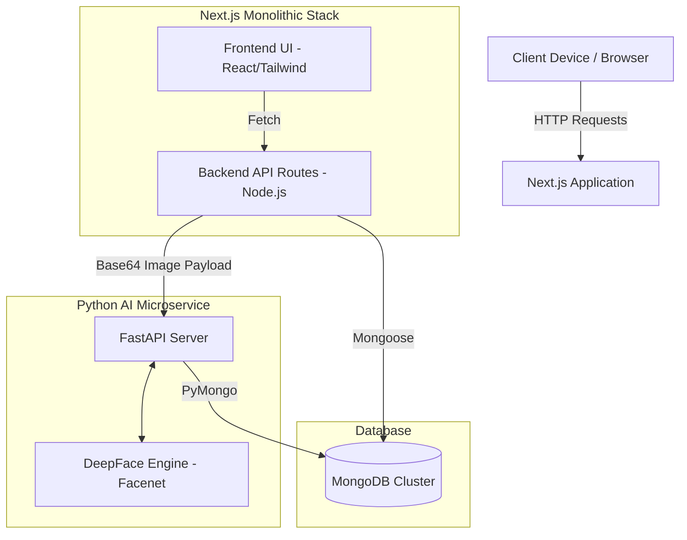
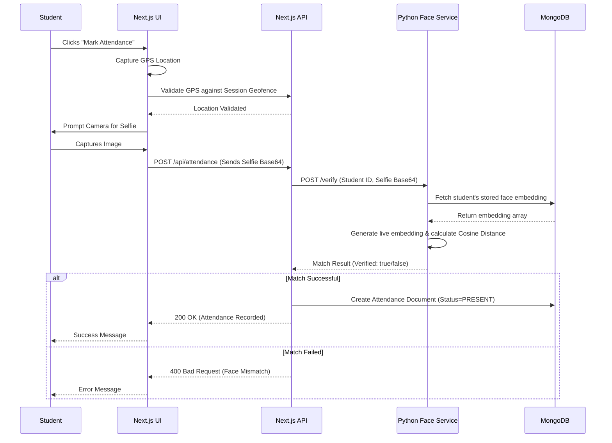

# GeoAttend - Detailed Documentation & High Level Design

## 1. Overview
**GeoAttend** is a modern, full-stack attendance management system designed to eliminate proxy attendance. It combines **Geofencing (GPS tracking)** and **Biometric Facial Recognition** to guarantee that students are physically present in the classroom and are who they claim to be. The application uses a hierarchical branch-centric and subject-based architecture, making it highly suitable for universities, colleges, and schools.

## 2. Technology Stack
*   **Frontend**: Next.js (React Framework).
*   **Backend (Core API)**: Next.js API Routes (Serverless Node.js).
*   **Database**: MongoDB (Object modeling via Mongoose).
*   **Biometric Microservice**: Python with FastAPI.
*   **Machine Learning**: DeepFace library utilizing the **Facenet** model for 1:1 facial verification.

## 3. Core Features & Workflows

### Teacher Capabilities
*   **Session Management**: Teachers can initiate an attendance "Session" for a specific branch and subject.
*   **Dynamic Geofencing**: Upon starting a session, the teacher's current GPS location (latitude and longitude) is captured to define the center of the geofence. A radius (defaulting to 50 meters) defines the acceptable attendance zone.
*   **Live Tracking**: Teachers can view real-time logs of which students have successfully marked their attendance.

### Student Capabilities
*   **Biometric Registration**: Students must perform a one-time face registration using their device's camera. This data is converted into a secure mathematical embedding.
*   **Session Discovery**: Students can view currently active sessions relevant to their specific branch.
*   **Two-Factor Attendance**: 
    1.  **Location Check**: The app verifies the student's GPS location against the active session's geofence.
    2.  **Biometric Check**: The student takes a live selfie, which is sent to the AI microservice to verify their identity.

### Facial Recognition Microservice (`face-service`)
*   An independent Python backend handling AI processing to keep the Next.js application lightweight.
*   **`/register`**: Receives a base64 image, extracts the face, checks for duplicates across the database to prevent one student registering multiple accounts, and stores the face embedding.
*   **`/verify`**: Receives a live selfie, extracts the face embedding, and calculates the cosine distance against the student's stored embedding. A match is confirmed if the distance falls below a strict threshold (0.40).
*   **Keep-Alive**: Includes an automated self-pinging loop to prevent the service from sleeping on free-tier cloud hosting (e.g., Render).

## 4. High Level Design (HLD)

### System Architecture
The application operates on a decoupled architecture where heavy ML tasks are offloaded from the core Node.js server to a specialized Python microservice.

### Component Details
1. **Client Tier**: Web application accessed via mobile. Uses the browser's Geolocation API for GPS bounding and MediaDevices API for taking live selfies.
2. **Next.js Web Server**: Acts as the orchestrator. Handles user authentication (JWT), session creation, and records the final attendance states.
3. **Python AI Service**: Stateless (mostly) service dedicated to generating facial embeddings from base64 strings and performing math (Cosine Distance) to verify identities.
4. **MongoDB Layer**: Central database. Notice that both the Next.js API and Python Microservice connect to it. The Python app interacts specifically with the `face_embeddings` collection, while Next.js handles `Users`, `Sessions`, and `Attendance` records.

### Sequence Diagram: Attendance Workflow

## 5. Database Schema (MongoDB)

### User Model
Stores all credentials and profile data for both teachers and students.
*   `name`, `email`, `password`
*   `role`: Defines access level (`TEACHER` or `STUDENT`).
*   `branch`, `semester`: Academic categorizations.
*   `rfidUid`: Optional hardware integration for RFID-based check-ins.

### Session Model
Represents a temporary, active class period.
*   `teacherId`: Reference to the user who created it.
*   `latitude`, `longitude`, `radius`: Geofencing parameters.
*   `branch`, `subject`: Class context.
*   `active`: Boolean toggle to open/close attendance.
*   `startTime`: Timestamp.

### Attendance Model
The final record of a student's presence.
*   `studentId`, `sessionId`: Relational references.
*   `date`, `branch`, `subject`: Search and filtering metadata.
*   `status`: Usually `PRESENT` or `ABSENT`.
*   `faceVerified`: Boolean confirming the AI passed the selfie.
*   `faceConfidence`: The similarity score of the facial match.
*   `selfieUrl`: Reference to the image taken (if stored).
*   *Note: An index ensures a student can only have one attendance record per session per day.*

## 6. Security & Anti-Spoofing Measures
*   **Proxy Prevention**: 1:1 facial verification prevents "buddy punching".
*   **Location Spoofing Prevention**: Strict GPS coordinate checking limits attendance tracking to a configurable radius (e.g., 50 meters) around the teacher.
*   **Duplicate Face Protection**: During biometric setup, the system scans the database to ensure the same physical face isn't registered to multiple student IDs.
